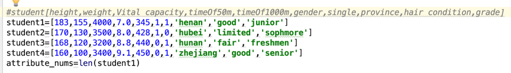
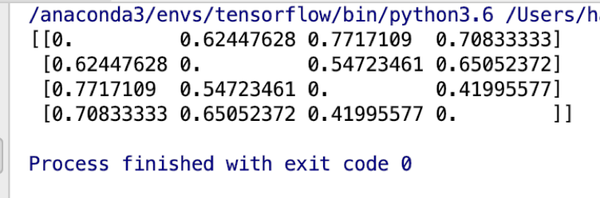
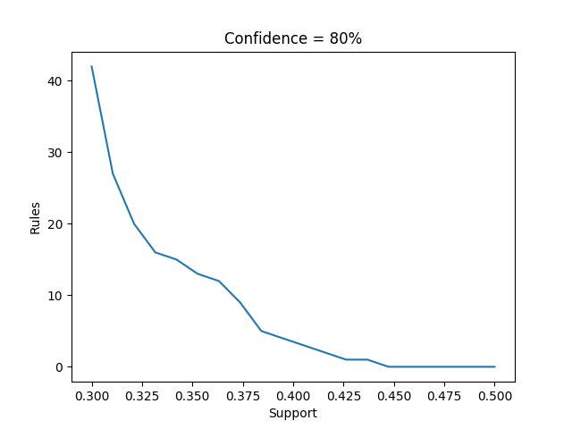
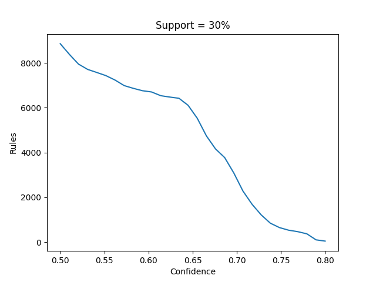
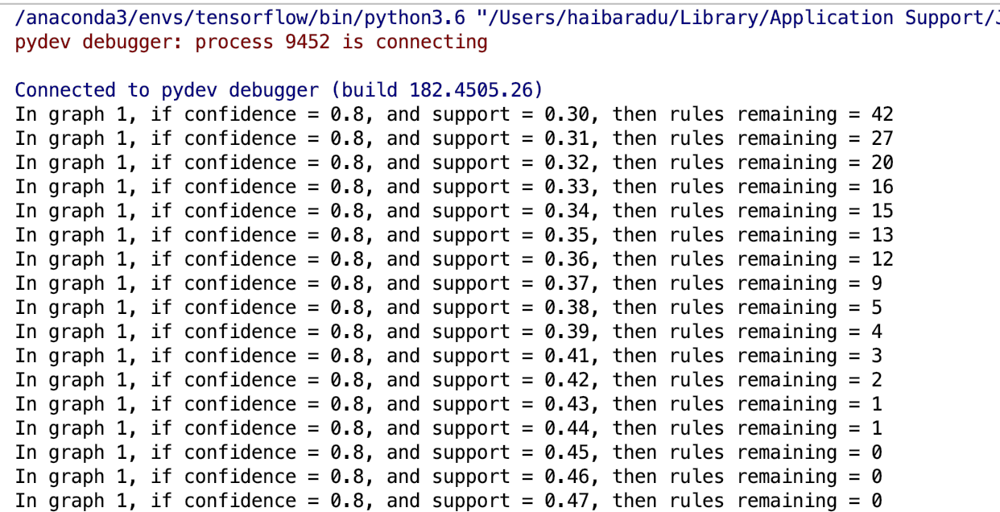
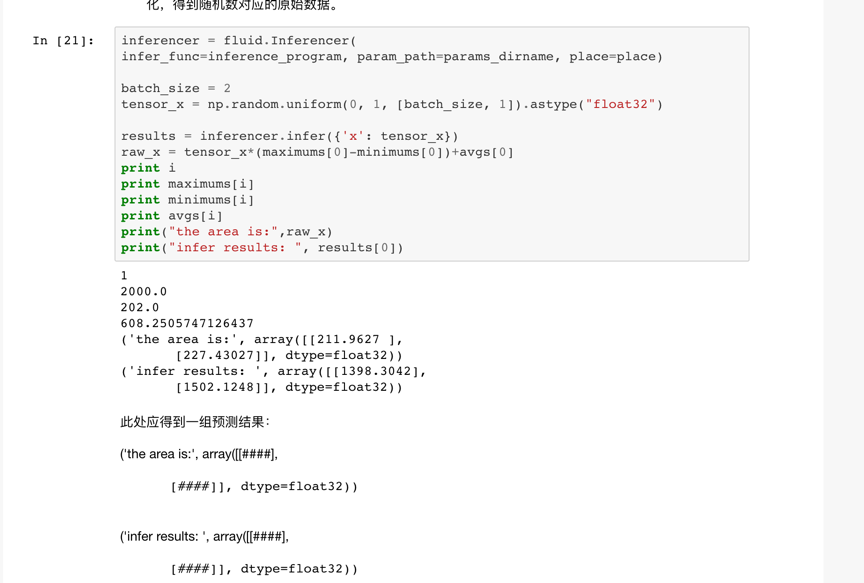
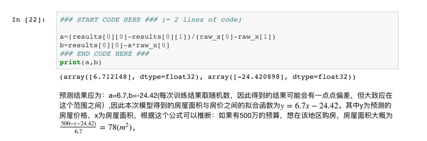
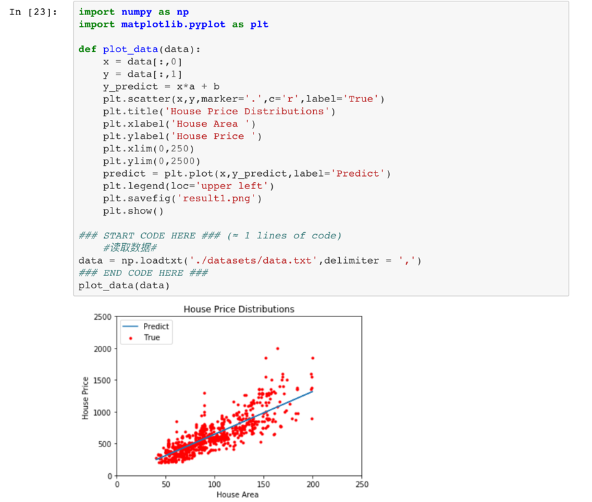

---

 
  

---

## 1.Legal issues for DATA MINING

&nbsp; Data mining will undoubtedly encounter several serious problems, among which privacy problems will take the leading position. One of the most famous examples is about the Prism Program. The American government violated numerous kinds of laws at the home and the broad and overlooked almost all the present rules in our world so that they can grab what they need. Meanwhile, as for our daily life, sometimes our crawlers may break the intellectual property law.

## 2.Skewness

The measure of how asymmetric a distribution can be is called skewness.

Provided with 1,2,2,3,3,3,4,4,5, we have skewness that is 0.

Provided with 1,2,2,2,3,3,4,4,5,5,6, we have skewness that is about 3.54.

Provided with 1,2,2,3,3,4,4,5,5,5,6, we have skewness that is about -5.52.

## 3. Box plot analysis

&nbsp; When it comes to the performance of each branch, I suppose that ***Branch 3*** is the best. Half of the unit price data is between $140 and $220 and it can be seen that this branch pays the most attention to the expensive products and also sells several products whose unit price is lower than $60. 

&nbsp; 75% of the products of ***Branch 1*** has the unit price that is lower than $100 but it still has a few expensive products.

&nbsp; Half of the products of ***Branch 2*** has the unit price that is between $60 and $100 and we can assume that this branch also has some high-level products because 25% of its products have the unit price between $160 and $180.

&nbsp; ***Branch 4*** has interesting data that seems like normal distribution.

## 4. Dataset issues for Q-Q plot

&nbsp; Taking my practice into consideration, I used to modify the dataset with the help of `MinMaxScaler()` from `sklearn`, which is a common operation named normalization that transforms the data into a scale like `(0,1)` and also keep some of their attributes. 

&nbsp; As for this problem, we may try to grab more data for the smaller one or wash some unsuitable data from the bigger one. Then I may find the **least common multiply** for the number of both datasets and transform the both the numbers to that degree. Then if necessary we can divide them and it seems that **the percentage of the data’s position after sort** counts more.

## 5. Dissimilarity matrix

&nbsp; My data is about the sports performance of some students and the data concludes several types like **numeric attributes**, **binary attributes** and **ordinary attributes**. We have 4 students and each student has 10 attributes.

More details can be seen in `dissimilarity.py`

## 6. Apriori and FP-Growth

&nbsp; The data generation part is related to both algorisms. Assume that we have 100 products and we divide them into 5 kinds. For each kind of the products, I assume that the first one will appear randomly with the help of `possiblity_first` and `threshold`. Then we have `possibility1[i]` and `possibility2[i]` to imitate the possibility that you buy the i*th* product of this kind when you buy of not buy the first product of this kind.

&nbsp; I must say it's weird that there are few implementations for these two algorithms in common libraries. I suppose apriori is not that good for big data because it will iterate all the data in each loop but FP-Growth can be efficient to use for the search engines.  

&nbsp; **Here is part of the result of apriori algorithm.**

&nbsp; **Here is the result of FP-Growth algorithm.**

&nbsp; **As we can see, when the number of rules remaining is 20 and confidence ratio=0.8, we have support ratio=0.32.**

## 7. House Price Prediction

&nbsp; As for me, AiStudio is really like a new baby when compared with Kaggle and it's a disaster to install PaddlePaddle on my own laptop. The name of my online project is **House price predict** and my name is **HaibaraDu**. 

&nbsp; Also here are some of the significant pictures. 

>Looks as if I am lucky enough to miss the problems of PaddlePaddle mentioned by others?
>
>  But if I can choose, I prefer Keras. 
> 
> LOL
